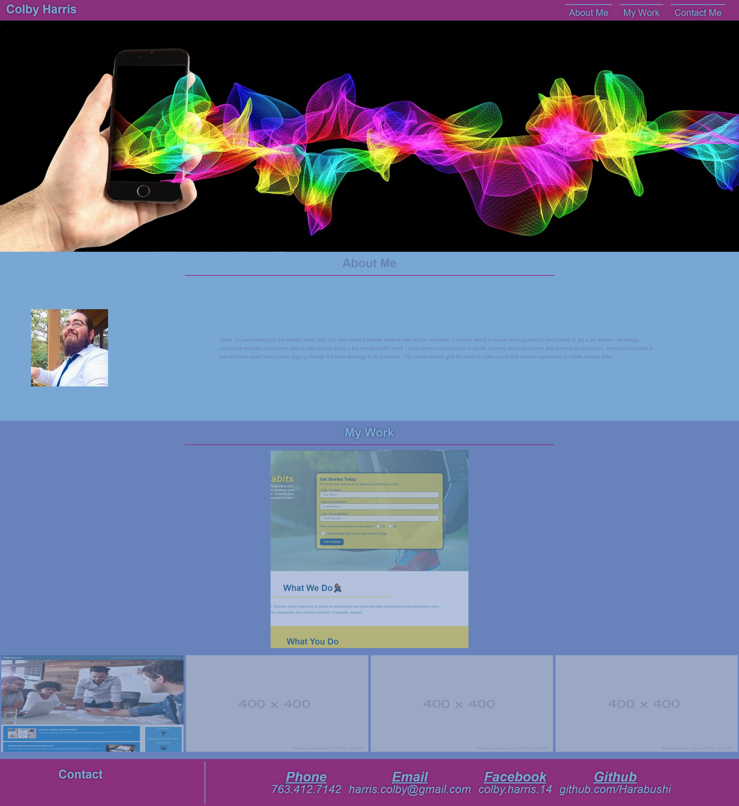

# My Portfolio
The purpose of this weekly challenge is to create the earliest version of my professional web developer portfolio showcasing the work I have already completed, the skills I have already learned, and leaving room for future projects to be added when I complete them.

### Deployed at: https://harabushi.github.io/Harabushi-Portfolio/
### Repository at: https://github.com/Harabushi/Harabushi-portfolio

 

